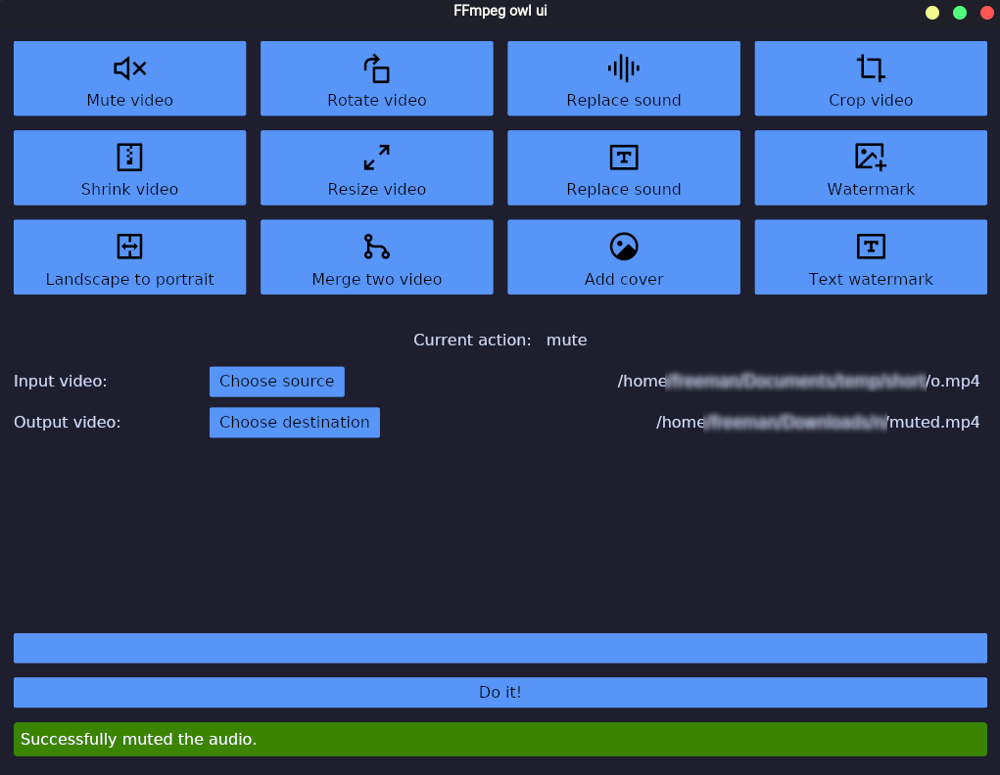

# ffmpeg-owl-ui
A useful ffmpeg ui

## LICENSE
This project under AGPv3 LICENSE.

## Screenshot



## how to compile

```bash
npm i
cargo run
```

### note

> The purpose of creating this project has been solely for my entertainment while learning the Rust language, and if there are any issues, I would appreciate it if you could remind me.
> 
> Thanks, A1Gard